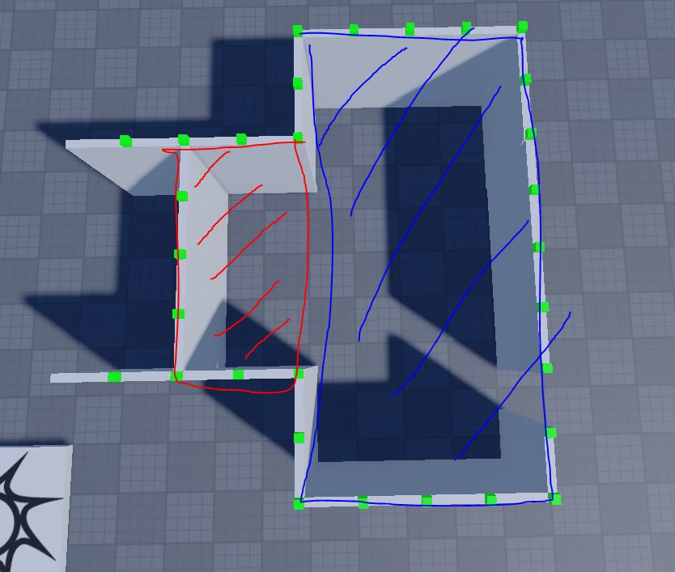
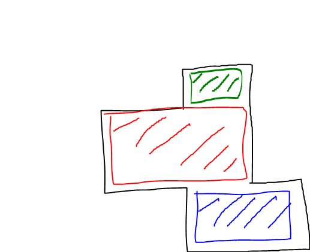

# Room-Detection
Room Detection for roblox <br>

<br>

I am trying to **identify and separate individual rooms**, even if they are *adjacent or share walls*. <br>
The code must also identify rooms that are **not** separated by walls shown in *Figure 2* <br>
<br>
Figure 1 <br>
<br>
Figure 2 <br>
<br>

***Region3 Result:*** <br>
<br>

**Problem**<br>
<br>
If the walls are too close together the code thinks it is all the same room since<br>
the code is hard coded to look in a 20x20 space around the node
```
local minBound = origin - Vector3.new(20, 10, 20) --16
local maxBound = origin + Vector3.new(20, 10, 20) --16
```
